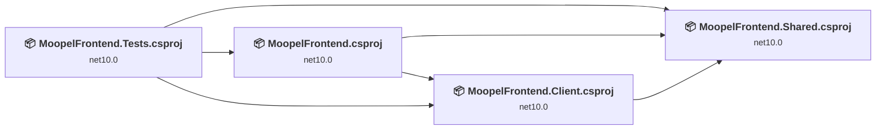
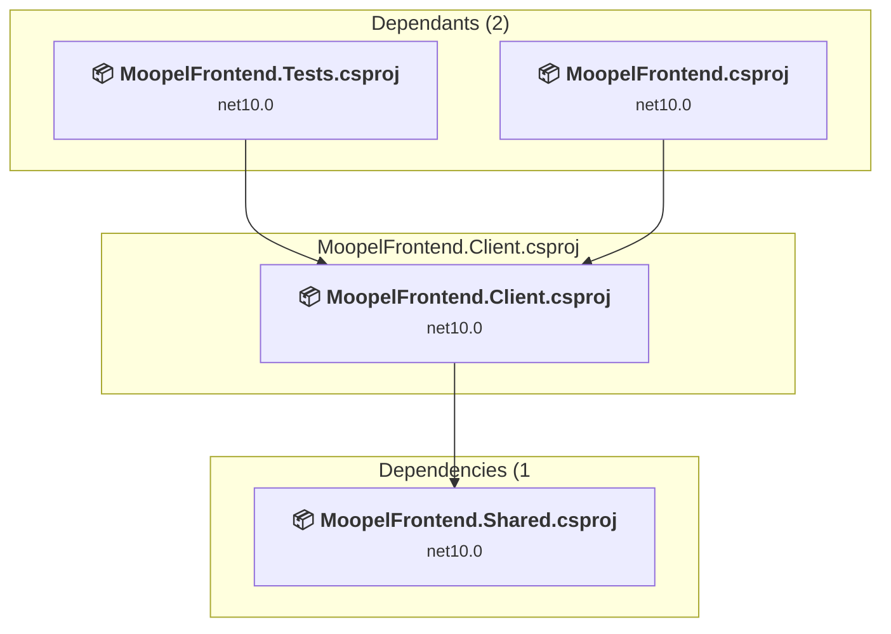
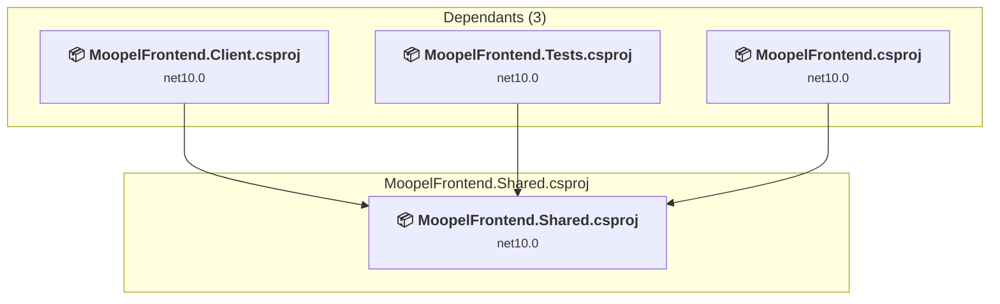
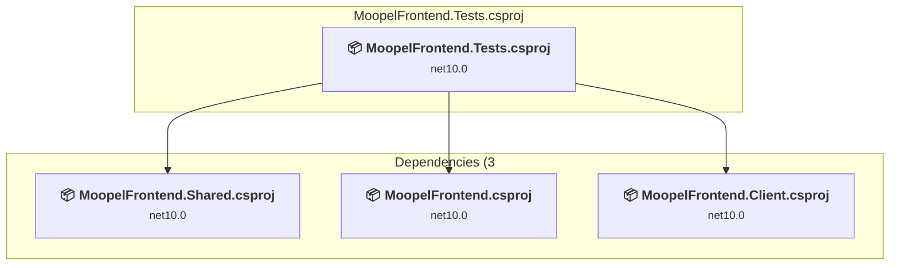
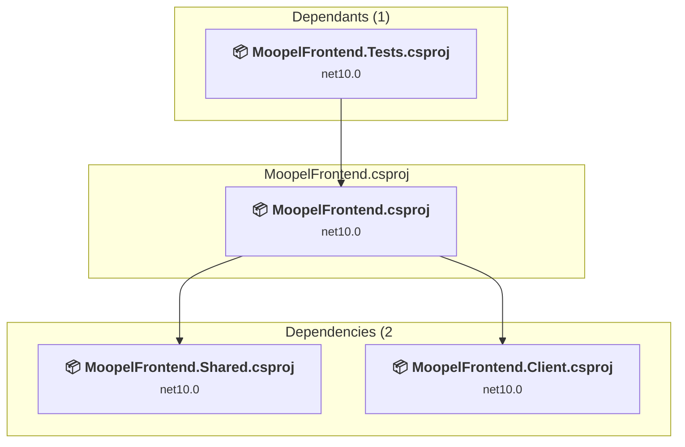

# Projects and dependencies analysis

This document provides a comprehensive overview of the projects and their dependencies in the context of upgrading to .NETCoreApp,Version=v11.0.

## Table of Contents

- [Executive Summary](#executive-Summary)
  - [Highlevel Metrics](#highlevel-metrics)
  - [Projects Compatibility](#projects-compatibility)
  - [Package Compatibility](#package-compatibility)
  - [API Compatibility](#api-compatibility)
  - [Binding Redirect Configuration](#binding-redirect-configuration)
- [Aggregate NuGet packages details](#aggregate-nuget-packages-details)
- [Top API Migration Challenges](#top-api-migration-challenges)
  - [Technologies and Features](#technologies-and-features)
  - [Most Frequent API Issues](#most-frequent-api-issues)
- [Projects Relationship Graph](#projects-relationship-graph)
- [Project Details](#project-details)

  - [MoopelFrontend.Client\MoopelFrontend.Client.csproj](#moopelfrontendclientmoopelfrontendclientcsproj)
  - [MoopelFrontend.Shared\MoopelFrontend.Shared.csproj](#moopelfrontendsharedmoopelfrontendsharedcsproj)
  - [MoopelFrontend.Tests\MoopelFrontend.Tests.csproj](#moopelfrontendtestsmoopelfrontendtestscsproj)
  - [MoopelFrontend\MoopelFrontend.csproj](#moopelfrontendmoopelfrontendcsproj)

## Executive Summary

### Highlevel Metrics

| Metric | Count | Status |
| :--- | :---: | :--- |
| Total Projects | 4 | All require upgrade |
| Total NuGet Packages | 99 | All compatible |
| Total Code Files | 38 |  |
| Total Code Files with Incidents | 10 |  |
| Total Lines of Code | 2161 |  |
| Total Number of Issues | 22 |  |
| Estimated LOC to modify | 18+ | at least 0.8% of codebase |

### Projects Compatibility

| Project | Target Framework | Difficulty | Package Issues | API Issues | Binding Issues | Est. LOC Impact | Description |
| :--- | :---: | :---: | :---: | :---: | :---: | :---: | :--- |
| [MoopelFrontend.Client\MoopelFrontend.Client.csproj](#moopelfrontendclientmoopelfrontendclientcsproj) | net10.0 | 🟢 Low | 0 | 5 | 0 | 5+ | AspNetCore, Sdk Style = True |
| [MoopelFrontend.Shared\MoopelFrontend.Shared.csproj](#moopelfrontendsharedmoopelfrontendsharedcsproj) | net10.0 | 🟢 Low | 0 | 3 | 0 | 3+ | ClassLibrary, Sdk Style = True |
| [MoopelFrontend.Tests\MoopelFrontend.Tests.csproj](#moopelfrontendtestsmoopelfrontendtestscsproj) | net10.0 | 🟢 Low | 0 | 3 | 0 | 3+ | DotNetCoreApp, Sdk Style = True |
| [MoopelFrontend\MoopelFrontend.csproj](#moopelfrontendmoopelfrontendcsproj) | net10.0 | 🟢 Low | 0 | 7 | 0 | 7+ | AspNetCore, Sdk Style = True |

### Package Compatibility

| Status | Count | Percentage |
| :--- | :---: | :---: |
| ✅ Compatible | 99 | 100.0% |
| ⚠️ Incompatible | 0 | 0.0% |
| 🔄 Upgrade Recommended | 0 | 0.0% |
| ***Total NuGet Packages*** | ***99*** | ***100%*** |

### API Compatibility

| Category | Count | Impact |
| :--- | :---: | :--- |
| 🔴 Binary Incompatible | 0 | High - Require code changes |
| 🟡 Source Incompatible | 0 | Medium - Needs re-compilation and potential conflicting API error fixing |
| 🔵 Behavioral change | 18 | Low - Behavioral changes that may require testing at runtime |
| ✅ Compatible | 5925 |  |
| ***Total APIs Analyzed*** | ***5943*** |  |

## Aggregate NuGet packages details

| Package | Current Version | Suggested Version | Projects | Description |
| :--- | :---: | :---: | :--- | :--- |
| AngleSharp | 1.7.0 |  | [MoopelFrontend.Tests.csproj](#moopelfrontendtestsmoopelfrontendtestscsproj) | ✅Compatible |
| AngleSharp.Css | 1.0.1 |  | [MoopelFrontend.Tests.csproj](#moopelfrontendtestsmoopelfrontendtestscsproj) | ✅Compatible |
| AngleSharp.Diffing | 1.1.1 |  | [MoopelFrontend.Tests.csproj](#moopelfrontendtestsmoopelfrontendtestscsproj) | ✅Compatible |
| bunit | 2.9.0 |  | [MoopelFrontend.Tests.csproj](#moopelfrontendtestsmoopelfrontendtestscsproj) | ✅Compatible |
| coverlet.collector | 10.0.1 |  | [MoopelFrontend.Tests.csproj](#moopelfrontendtestsmoopelfrontendtestscsproj) | ✅Compatible |
| Microsoft.ApplicationInsights | 2.23.0 |  | [MoopelFrontend.Tests.csproj](#moopelfrontendtestsmoopelfrontendtestscsproj) | ✅Compatible |
| Microsoft.AspNetCore.App.Internal.Assets | 10.0.11 |  | [MoopelFrontend.Client.csproj](#moopelfrontendclientmoopelfrontendclientcsproj) [MoopelFrontend.csproj](#moopelfrontendmoopelfrontendcsproj) | ✅Compatible |
| Microsoft.AspNetCore.Authorization | 10.0.11 |  | [MoopelFrontend.Client.csproj](#moopelfrontendclientmoopelfrontendclientcsproj) [MoopelFrontend.Shared.csproj](#moopelfrontendsharedmoopelfrontendsharedcsproj) [MoopelFrontend.Tests.csproj](#moopelfrontendtestsmoopelfrontendtestscsproj) | ✅Compatible |
| Microsoft.AspNetCore.Components | 10.0.11 |  | [MoopelFrontend.Client.csproj](#moopelfrontendclientmoopelfrontendclientcsproj) [MoopelFrontend.Shared.csproj](#moopelfrontendsharedmoopelfrontendsharedcsproj) [MoopelFrontend.Tests.csproj](#moopelfrontendtestsmoopelfrontendtestscsproj) | ✅Compatible |
| Microsoft.AspNetCore.Components.Analyzers | 10.0.11 |  | [MoopelFrontend.Client.csproj](#moopelfrontendclientmoopelfrontendclientcsproj) [MoopelFrontend.Shared.csproj](#moopelfrontendsharedmoopelfrontendsharedcsproj) [MoopelFrontend.Tests.csproj](#moopelfrontendtestsmoopelfrontendtestscsproj) | ✅Compatible |
| Microsoft.AspNetCore.Components.Authorization | 10.0.11 |  | [MoopelFrontend.Client.csproj](#moopelfrontendclientmoopelfrontendclientcsproj) [MoopelFrontend.Shared.csproj](#moopelfrontendsharedmoopelfrontendsharedcsproj) [MoopelFrontend.Tests.csproj](#moopelfrontendtestsmoopelfrontendtestscsproj) | ✅Compatible |
| Microsoft.AspNetCore.Components.Forms | 10.0.11 |  | [MoopelFrontend.Client.csproj](#moopelfrontendclientmoopelfrontendclientcsproj) [MoopelFrontend.Shared.csproj](#moopelfrontendsharedmoopelfrontendsharedcsproj) [MoopelFrontend.Tests.csproj](#moopelfrontendtestsmoopelfrontendtestscsproj) | ✅Compatible |
| Microsoft.AspNetCore.Components.Web | 10.0.11 |  | [MoopelFrontend.Client.csproj](#moopelfrontendclientmoopelfrontendclientcsproj) [MoopelFrontend.Shared.csproj](#moopelfrontendsharedmoopelfrontendsharedcsproj) [MoopelFrontend.Tests.csproj](#moopelfrontendtestsmoopelfrontendtestscsproj) | ✅Compatible |
| Microsoft.AspNetCore.Components.WebAssembly | 10.0.11 |  | [MoopelFrontend.Client.csproj](#moopelfrontendclientmoopelfrontendclientcsproj) [MoopelFrontend.csproj](#moopelfrontendmoopelfrontendcsproj) [MoopelFrontend.Tests.csproj](#moopelfrontendtestsmoopelfrontendtestscsproj) | ✅Compatible |
| Microsoft.AspNetCore.Components.WebAssembly.Authentication | 10.0.10 |  | [MoopelFrontend.Tests.csproj](#moopelfrontendtestsmoopelfrontendtestscsproj) | ✅Compatible |
| Microsoft.AspNetCore.Components.WebAssembly.DevServer | 10.0.11 |  | [MoopelFrontend.Client.csproj](#moopelfrontendclientmoopelfrontendclientcsproj) [MoopelFrontend.csproj](#moopelfrontendmoopelfrontendcsproj) [MoopelFrontend.Tests.csproj](#moopelfrontendtestsmoopelfrontendtestscsproj) | ✅Compatible |
| Microsoft.AspNetCore.Components.WebAssembly.Server | 10.0.11 |  | [MoopelFrontend.csproj](#moopelfrontendmoopelfrontendcsproj) [MoopelFrontend.Tests.csproj](#moopelfrontendtestsmoopelfrontendtestscsproj) | ✅Compatible |
| Microsoft.AspNetCore.Hosting.Abstractions | 2.3.12 |  | [MoopelFrontend.Tests.csproj](#moopelfrontendtestsmoopelfrontendtestscsproj) | ✅Compatible |
| Microsoft.AspNetCore.Hosting.Server.Abstractions | 2.3.11 |  | [MoopelFrontend.Tests.csproj](#moopelfrontendtestsmoopelfrontendtestscsproj) | ✅Compatible |
| Microsoft.AspNetCore.Http | 2.3.12 |  | [MoopelFrontend.Client.csproj](#moopelfrontendclientmoopelfrontendclientcsproj) [MoopelFrontend.Shared.csproj](#moopelfrontendsharedmoopelfrontendsharedcsproj) [MoopelFrontend.Tests.csproj](#moopelfrontendtestsmoopelfrontendtestscsproj) | ✅Compatible |
| Microsoft.AspNetCore.Http.Abstractions | 2.3.11 |  | [MoopelFrontend.Client.csproj](#moopelfrontendclientmoopelfrontendclientcsproj) [MoopelFrontend.Shared.csproj](#moopelfrontendsharedmoopelfrontendsharedcsproj) [MoopelFrontend.Tests.csproj](#moopelfrontendtestsmoopelfrontendtestscsproj) | ✅Compatible |
| Microsoft.AspNetCore.Http.Features | 2.3.10 |  | [MoopelFrontend.Client.csproj](#moopelfrontendclientmoopelfrontendclientcsproj) [MoopelFrontend.Shared.csproj](#moopelfrontendsharedmoopelfrontendsharedcsproj) [MoopelFrontend.Tests.csproj](#moopelfrontendtestsmoopelfrontendtestscsproj) | ✅Compatible |
| Microsoft.AspNetCore.Metadata | 10.0.11 |  | [MoopelFrontend.Client.csproj](#moopelfrontendclientmoopelfrontendclientcsproj) [MoopelFrontend.Shared.csproj](#moopelfrontendsharedmoopelfrontendsharedcsproj) [MoopelFrontend.Tests.csproj](#moopelfrontendtestsmoopelfrontendtestscsproj) | ✅Compatible |
| Microsoft.AspNetCore.Mvc.Testing | 10.0.11 |  | [MoopelFrontend.Tests.csproj](#moopelfrontendtestsmoopelfrontendtestscsproj) | ✅Compatible |
| Microsoft.AspNetCore.TestHost | 10.0.11 |  | [MoopelFrontend.Tests.csproj](#moopelfrontendtestsmoopelfrontendtestscsproj) | ✅Compatible |
| Microsoft.AspNetCore.WebUtilities | 2.3.11 |  | [MoopelFrontend.Client.csproj](#moopelfrontendclientmoopelfrontendclientcsproj) [MoopelFrontend.Shared.csproj](#moopelfrontendsharedmoopelfrontendsharedcsproj) [MoopelFrontend.Tests.csproj](#moopelfrontendtestsmoopelfrontendtestscsproj) | ✅Compatible |
| Microsoft.Bcl.AsyncInterfaces | 6.0.0 |  | [MoopelFrontend.Tests.csproj](#moopelfrontendtestsmoopelfrontendtestscsproj) | ✅Compatible |
| Microsoft.CodeCoverage | 18.8.1 |  | [MoopelFrontend.Tests.csproj](#moopelfrontendtestsmoopelfrontendtestscsproj) | ✅Compatible |
| Microsoft.Extensions.Caching.Abstractions | 10.0.10 |  | [MoopelFrontend.Tests.csproj](#moopelfrontendtestsmoopelfrontendtestscsproj) | ✅Compatible |
| Microsoft.Extensions.Caching.Memory | 10.0.10 |  | [MoopelFrontend.Tests.csproj](#moopelfrontendtestsmoopelfrontendtestscsproj) | ✅Compatible |
| Microsoft.Extensions.Configuration | 10.0.11 |  | [MoopelFrontend.Client.csproj](#moopelfrontendclientmoopelfrontendclientcsproj) [MoopelFrontend.Shared.csproj](#moopelfrontendsharedmoopelfrontendsharedcsproj) [MoopelFrontend.Tests.csproj](#moopelfrontendtestsmoopelfrontendtestscsproj) | ✅Compatible |
| Microsoft.Extensions.Configuration.Abstractions | 10.0.11 |  | [MoopelFrontend.Client.csproj](#moopelfrontendclientmoopelfrontendclientcsproj) [MoopelFrontend.Shared.csproj](#moopelfrontendsharedmoopelfrontendsharedcsproj) [MoopelFrontend.Tests.csproj](#moopelfrontendtestsmoopelfrontendtestscsproj) | ✅Compatible |
| Microsoft.Extensions.Configuration.Binder | 10.0.11 |  | [MoopelFrontend.Client.csproj](#moopelfrontendclientmoopelfrontendclientcsproj) [MoopelFrontend.Shared.csproj](#moopelfrontendsharedmoopelfrontendsharedcsproj) [MoopelFrontend.Tests.csproj](#moopelfrontendtestsmoopelfrontendtestscsproj) | ✅Compatible |
| Microsoft.Extensions.Configuration.CommandLine | 10.0.11 |  | [MoopelFrontend.Tests.csproj](#moopelfrontendtestsmoopelfrontendtestscsproj) | ✅Compatible |
| Microsoft.Extensions.Configuration.EnvironmentVariables | 10.0.11 |  | [MoopelFrontend.Tests.csproj](#moopelfrontendtestsmoopelfrontendtestscsproj) | ✅Compatible |
| Microsoft.Extensions.Configuration.FileExtensions | 10.0.11 |  | [MoopelFrontend.Client.csproj](#moopelfrontendclientmoopelfrontendclientcsproj) [MoopelFrontend.Tests.csproj](#moopelfrontendtestsmoopelfrontendtestscsproj) | ✅Compatible |
| Microsoft.Extensions.Configuration.Json | 10.0.11 |  | [MoopelFrontend.Client.csproj](#moopelfrontendclientmoopelfrontendclientcsproj) [MoopelFrontend.Tests.csproj](#moopelfrontendtestsmoopelfrontendtestscsproj) | ✅Compatible |
| Microsoft.Extensions.Configuration.UserSecrets | 10.0.11 |  | [MoopelFrontend.Tests.csproj](#moopelfrontendtestsmoopelfrontendtestscsproj) | ✅Compatible |
| Microsoft.Extensions.DependencyInjection | 10.0.11 |  | [MoopelFrontend.Client.csproj](#moopelfrontendclientmoopelfrontendclientcsproj) [MoopelFrontend.Shared.csproj](#moopelfrontendsharedmoopelfrontendsharedcsproj) [MoopelFrontend.Tests.csproj](#moopelfrontendtestsmoopelfrontendtestscsproj) | ✅Compatible |
| Microsoft.Extensions.DependencyInjection.Abstractions | 10.0.11 |  | [MoopelFrontend.Client.csproj](#moopelfrontendclientmoopelfrontendclientcsproj) [MoopelFrontend.Shared.csproj](#moopelfrontendsharedmoopelfrontendsharedcsproj) [MoopelFrontend.Tests.csproj](#moopelfrontendtestsmoopelfrontendtestscsproj) | ✅Compatible |
| Microsoft.Extensions.DependencyModel | 10.0.0 |  | [MoopelFrontend.csproj](#moopelfrontendmoopelfrontendcsproj) | ✅Compatible |
| Microsoft.Extensions.DependencyModel | 10.0.11 |  | [MoopelFrontend.Tests.csproj](#moopelfrontendtestsmoopelfrontendtestscsproj) | ✅Compatible |
| Microsoft.Extensions.Diagnostics | 10.0.11 |  | [MoopelFrontend.Client.csproj](#moopelfrontendclientmoopelfrontendclientcsproj) [MoopelFrontend.Shared.csproj](#moopelfrontendsharedmoopelfrontendsharedcsproj) [MoopelFrontend.Tests.csproj](#moopelfrontendtestsmoopelfrontendtestscsproj) | ✅Compatible |
| Microsoft.Extensions.Diagnostics.Abstractions | 10.0.11 |  | [MoopelFrontend.Client.csproj](#moopelfrontendclientmoopelfrontendclientcsproj) [MoopelFrontend.Shared.csproj](#moopelfrontendsharedmoopelfrontendsharedcsproj) [MoopelFrontend.Tests.csproj](#moopelfrontendtestsmoopelfrontendtestscsproj) | ✅Compatible |
| Microsoft.Extensions.FileProviders.Abstractions | 10.0.11 |  | [MoopelFrontend.Client.csproj](#moopelfrontendclientmoopelfrontendclientcsproj) [MoopelFrontend.Tests.csproj](#moopelfrontendtestsmoopelfrontendtestscsproj) | ✅Compatible |
| Microsoft.Extensions.FileProviders.Physical | 10.0.11 |  | [MoopelFrontend.Client.csproj](#moopelfrontendclientmoopelfrontendclientcsproj) [MoopelFrontend.Tests.csproj](#moopelfrontendtestsmoopelfrontendtestscsproj) | ✅Compatible |
| Microsoft.Extensions.FileSystemGlobbing | 10.0.11 |  | [MoopelFrontend.Client.csproj](#moopelfrontendclientmoopelfrontendclientcsproj) [MoopelFrontend.Tests.csproj](#moopelfrontendtestsmoopelfrontendtestscsproj) | ✅Compatible |
| Microsoft.Extensions.Hosting | 10.0.11 |  | [MoopelFrontend.Tests.csproj](#moopelfrontendtestsmoopelfrontendtestscsproj) | ✅Compatible |
| Microsoft.Extensions.Hosting.Abstractions | 10.0.11 |  | [MoopelFrontend.Tests.csproj](#moopelfrontendtestsmoopelfrontendtestscsproj) | ✅Compatible |
| Microsoft.Extensions.Http | 10.0.11 |  | [MoopelFrontend.Client.csproj](#moopelfrontendclientmoopelfrontendclientcsproj) [MoopelFrontend.Tests.csproj](#moopelfrontendtestsmoopelfrontendtestscsproj) | ✅Compatible |
| Microsoft.Extensions.Localization.Abstractions | 10.0.10 |  | [MoopelFrontend.Tests.csproj](#moopelfrontendtestsmoopelfrontendtestscsproj) | ✅Compatible |
| Microsoft.Extensions.Logging | 10.0.11 |  | [MoopelFrontend.Client.csproj](#moopelfrontendclientmoopelfrontendclientcsproj) [MoopelFrontend.Tests.csproj](#moopelfrontendtestsmoopelfrontendtestscsproj) | ✅Compatible |
| Microsoft.Extensions.Logging.Abstractions | 10.0.11 |  | [MoopelFrontend.Client.csproj](#moopelfrontendclientmoopelfrontendclientcsproj) [MoopelFrontend.Shared.csproj](#moopelfrontendsharedmoopelfrontendsharedcsproj) [MoopelFrontend.Tests.csproj](#moopelfrontendtestsmoopelfrontendtestscsproj) | ✅Compatible |
| Microsoft.Extensions.Logging.Configuration | 10.0.11 |  | [MoopelFrontend.Tests.csproj](#moopelfrontendtestsmoopelfrontendtestscsproj) | ✅Compatible |
| Microsoft.Extensions.Logging.Console | 10.0.11 |  | [MoopelFrontend.Tests.csproj](#moopelfrontendtestsmoopelfrontendtestscsproj) | ✅Compatible |
| Microsoft.Extensions.Logging.Debug | 10.0.11 |  | [MoopelFrontend.Tests.csproj](#moopelfrontendtestsmoopelfrontendtestscsproj) | ✅Compatible |
| Microsoft.Extensions.Logging.EventLog | 10.0.11 |  | [MoopelFrontend.Tests.csproj](#moopelfrontendtestsmoopelfrontendtestscsproj) | ✅Compatible |
| Microsoft.Extensions.Logging.EventSource | 10.0.11 |  | [MoopelFrontend.Tests.csproj](#moopelfrontendtestsmoopelfrontendtestscsproj) | ✅Compatible |
| Microsoft.Extensions.ObjectPool | 8.0.11 |  | [MoopelFrontend.Client.csproj](#moopelfrontendclientmoopelfrontendclientcsproj) [MoopelFrontend.Shared.csproj](#moopelfrontendsharedmoopelfrontendsharedcsproj) [MoopelFrontend.Tests.csproj](#moopelfrontendtestsmoopelfrontendtestscsproj) | ✅Compatible |
| Microsoft.Extensions.Options | 10.0.11 |  | [MoopelFrontend.Client.csproj](#moopelfrontendclientmoopelfrontendclientcsproj) [MoopelFrontend.Shared.csproj](#moopelfrontendsharedmoopelfrontendsharedcsproj) [MoopelFrontend.Tests.csproj](#moopelfrontendtestsmoopelfrontendtestscsproj) | ✅Compatible |
| Microsoft.Extensions.Options.ConfigurationExtensions | 10.0.11 |  | [MoopelFrontend.Client.csproj](#moopelfrontendclientmoopelfrontendclientcsproj) [MoopelFrontend.Shared.csproj](#moopelfrontendsharedmoopelfrontendsharedcsproj) [MoopelFrontend.Tests.csproj](#moopelfrontendtestsmoopelfrontendtestscsproj) | ✅Compatible |
| Microsoft.Extensions.Primitives | 10.0.11 |  | [MoopelFrontend.Client.csproj](#moopelfrontendclientmoopelfrontendclientcsproj) [MoopelFrontend.Shared.csproj](#moopelfrontendsharedmoopelfrontendsharedcsproj) [MoopelFrontend.Tests.csproj](#moopelfrontendtestsmoopelfrontendtestscsproj) | ✅Compatible |
| Microsoft.Extensions.Validation | 10.0.11 |  | [MoopelFrontend.Client.csproj](#moopelfrontendclientmoopelfrontendclientcsproj) [MoopelFrontend.Shared.csproj](#moopelfrontendsharedmoopelfrontendsharedcsproj) [MoopelFrontend.Tests.csproj](#moopelfrontendtestsmoopelfrontendtestscsproj) | ✅Compatible |
| Microsoft.JSInterop | 10.0.11 |  | [MoopelFrontend.Client.csproj](#moopelfrontendclientmoopelfrontendclientcsproj) [MoopelFrontend.Shared.csproj](#moopelfrontendsharedmoopelfrontendsharedcsproj) [MoopelFrontend.Tests.csproj](#moopelfrontendtestsmoopelfrontendtestscsproj) | ✅Compatible |
| Microsoft.JSInterop.WebAssembly | 10.0.11 |  | [MoopelFrontend.Client.csproj](#moopelfrontendclientmoopelfrontendclientcsproj) [MoopelFrontend.csproj](#moopelfrontendmoopelfrontendcsproj) [MoopelFrontend.Tests.csproj](#moopelfrontendtestsmoopelfrontendtestscsproj) | ✅Compatible |
| Microsoft.Net.Http.Headers | 2.3.11 |  | [MoopelFrontend.Client.csproj](#moopelfrontendclientmoopelfrontendclientcsproj) [MoopelFrontend.Shared.csproj](#moopelfrontendsharedmoopelfrontendsharedcsproj) [MoopelFrontend.Tests.csproj](#moopelfrontendtestsmoopelfrontendtestscsproj) | ✅Compatible |
| Microsoft.NET.ILLink.Tasks | 10.0.11 |  | [MoopelFrontend.Client.csproj](#moopelfrontendclientmoopelfrontendclientcsproj) | ✅Compatible |
| Microsoft.NET.Sdk.WebAssembly.Pack | 10.0.11 |  | [MoopelFrontend.Client.csproj](#moopelfrontendclientmoopelfrontendclientcsproj) | ✅Compatible |
| Microsoft.NET.Test.Sdk | 18.8.1 |  | [MoopelFrontend.Tests.csproj](#moopelfrontendtestsmoopelfrontendtestscsproj) | ✅Compatible |
| Microsoft.Testing.Extensions.Telemetry | 1.9.1 |  | [MoopelFrontend.Tests.csproj](#moopelfrontendtestsmoopelfrontendtestscsproj) | ✅Compatible |
| Microsoft.Testing.Extensions.TrxReport.Abstractions | 1.9.1 |  | [MoopelFrontend.Tests.csproj](#moopelfrontendtestsmoopelfrontendtestscsproj) | ✅Compatible |
| Microsoft.Testing.Platform | 1.9.1 |  | [MoopelFrontend.Tests.csproj](#moopelfrontendtestsmoopelfrontendtestscsproj) | ✅Compatible |
| Microsoft.Testing.Platform.MSBuild | 1.9.1 |  | [MoopelFrontend.Tests.csproj](#moopelfrontendtestsmoopelfrontendtestscsproj) | ✅Compatible |
| Microsoft.TestPlatform.ObjectModel | 18.8.1 |  | [MoopelFrontend.Tests.csproj](#moopelfrontendtestsmoopelfrontendtestscsproj) | ✅Compatible |
| Microsoft.TestPlatform.TestHost | 18.8.1 |  | [MoopelFrontend.Tests.csproj](#moopelfrontendtestsmoopelfrontendtestscsproj) | ✅Compatible |
| Microsoft.Win32.Registry | 5.0.0 |  | [MoopelFrontend.Tests.csproj](#moopelfrontendtestsmoopelfrontendtestscsproj) | ✅Compatible |
| Moopel.Objects | 2.0.3 |  | [MoopelFrontend.Client.csproj](#moopelfrontendclientmoopelfrontendclientcsproj) [MoopelFrontend.csproj](#moopelfrontendmoopelfrontendcsproj) [MoopelFrontend.Shared.csproj](#moopelfrontendsharedmoopelfrontendsharedcsproj) [MoopelFrontend.Tests.csproj](#moopelfrontendtestsmoopelfrontendtestscsproj) | ✅Compatible |
| Serilog | 4.4.0 |  | [MoopelFrontend.Client.csproj](#moopelfrontendclientmoopelfrontendclientcsproj) [MoopelFrontend.csproj](#moopelfrontendmoopelfrontendcsproj) [MoopelFrontend.Tests.csproj](#moopelfrontendtestsmoopelfrontendtestscsproj) | ✅Compatible |
| Serilog.AspNetCore | 10.0.0 |  | [MoopelFrontend.csproj](#moopelfrontendmoopelfrontendcsproj) [MoopelFrontend.Tests.csproj](#moopelfrontendtestsmoopelfrontendtestscsproj) | ✅Compatible |
| Serilog.Extensions.Hosting | 10.0.0 |  | [MoopelFrontend.csproj](#moopelfrontendmoopelfrontendcsproj) [MoopelFrontend.Tests.csproj](#moopelfrontendtestsmoopelfrontendtestscsproj) | ✅Compatible |
| Serilog.Extensions.Logging | 10.0.0 |  | [MoopelFrontend.Client.csproj](#moopelfrontendclientmoopelfrontendclientcsproj) [MoopelFrontend.csproj](#moopelfrontendmoopelfrontendcsproj) [MoopelFrontend.Tests.csproj](#moopelfrontendtestsmoopelfrontendtestscsproj) | ✅Compatible |
| Serilog.Formatting.Compact | 3.0.0 |  | [MoopelFrontend.csproj](#moopelfrontendmoopelfrontendcsproj) [MoopelFrontend.Tests.csproj](#moopelfrontendtestsmoopelfrontendtestscsproj) | ✅Compatible |
| Serilog.Settings.Configuration | 10.0.0 |  | [MoopelFrontend.csproj](#moopelfrontendmoopelfrontendcsproj) [MoopelFrontend.Tests.csproj](#moopelfrontendtestsmoopelfrontendtestscsproj) | ✅Compatible |
| Serilog.Sinks.BrowserConsole | 8.0.0 |  | [MoopelFrontend.Client.csproj](#moopelfrontendclientmoopelfrontendclientcsproj) [MoopelFrontend.csproj](#moopelfrontendmoopelfrontendcsproj) [MoopelFrontend.Tests.csproj](#moopelfrontendtestsmoopelfrontendtestscsproj) | ✅Compatible |
| Serilog.Sinks.Console | 6.1.1 |  | [MoopelFrontend.csproj](#moopelfrontendmoopelfrontendcsproj) [MoopelFrontend.Tests.csproj](#moopelfrontendtestsmoopelfrontendtestscsproj) | ✅Compatible |
| Serilog.Sinks.Debug | 3.0.0 |  | [MoopelFrontend.csproj](#moopelfrontendmoopelfrontendcsproj) [MoopelFrontend.Tests.csproj](#moopelfrontendtestsmoopelfrontendtestscsproj) | ✅Compatible |
| Serilog.Sinks.File | 7.0.0 |  | [MoopelFrontend.Client.csproj](#moopelfrontendclientmoopelfrontendclientcsproj) [MoopelFrontend.csproj](#moopelfrontendmoopelfrontendcsproj) [MoopelFrontend.Tests.csproj](#moopelfrontendtestsmoopelfrontendtestscsproj) | ✅Compatible |
| Serilog.Sinks.Http | 9.2.1 |  | [MoopelFrontend.Client.csproj](#moopelfrontendclientmoopelfrontendclientcsproj) [MoopelFrontend.csproj](#moopelfrontendmoopelfrontendcsproj) [MoopelFrontend.Tests.csproj](#moopelfrontendtestsmoopelfrontendtestscsproj) | ✅Compatible |
| System.Diagnostics.EventLog | 10.0.11 |  | [MoopelFrontend.Tests.csproj](#moopelfrontendtestsmoopelfrontendtestscsproj) | ✅Compatible |
| xunit.analyzers | 1.27.0 |  | [MoopelFrontend.Tests.csproj](#moopelfrontendtestsmoopelfrontendtestscsproj) | ✅Compatible |
| xunit.runner.visualstudio | 3.1.5 |  | [MoopelFrontend.Tests.csproj](#moopelfrontendtestsmoopelfrontendtestscsproj) | ✅Compatible |
| xunit.v3 | 3.2.2 |  | [MoopelFrontend.Tests.csproj](#moopelfrontendtestsmoopelfrontendtestscsproj) | ✅Compatible |
| xunit.v3.assert | 3.2.2 |  | [MoopelFrontend.Tests.csproj](#moopelfrontendtestsmoopelfrontendtestscsproj) | ✅Compatible |
| xunit.v3.common | 3.2.2 |  | [MoopelFrontend.Tests.csproj](#moopelfrontendtestsmoopelfrontendtestscsproj) | ✅Compatible |
| xunit.v3.core.mtp-v1 | 3.2.2 |  | [MoopelFrontend.Tests.csproj](#moopelfrontendtestsmoopelfrontendtestscsproj) | ✅Compatible |
| xunit.v3.extensibility.core | 3.2.2 |  | [MoopelFrontend.Tests.csproj](#moopelfrontendtestsmoopelfrontendtestscsproj) | ✅Compatible |
| xunit.v3.mtp-v1 | 3.2.2 |  | [MoopelFrontend.Tests.csproj](#moopelfrontendtestsmoopelfrontendtestscsproj) | ✅Compatible |
| xunit.v3.runner.common | 3.2.2 |  | [MoopelFrontend.Tests.csproj](#moopelfrontendtestsmoopelfrontendtestscsproj) | ✅Compatible |
| xunit.v3.runner.inproc.console | 3.2.2 |  | [MoopelFrontend.Tests.csproj](#moopelfrontendtestsmoopelfrontendtestscsproj) | ✅Compatible |

## Top API Migration Challenges

### Technologies and Features

| Technology | Issues | Percentage | Migration Path |
| :--- | :---: | :---: | :--- |

### Most Frequent API Issues

| API | Count | Percentage | Category |
| :--- | :---: | :---: | :--- |
| T:System.Uri | 8 | 44.4% | Behavioral Change |
| T:System.Net.Http.HttpContent | 4 | 22.2% | Behavioral Change |
| M:System.Uri.#ctor(System.String,System.UriKind) | 2 | 11.1% | Behavioral Change |
| M:System.Uri.TryCreate(System.String,System.UriKind,System.Uri@) | 2 | 11.1% | Behavioral Change |
| M:Microsoft.AspNetCore.Builder.ExceptionHandlerExtensions.UseExceptionHandler(Microsoft.AspNetCore.Builder.IApplicationBuilder,System.String,System.Boolean) | 1 | 5.6% | Behavioral Change |
| M:Microsoft.Extensions.Logging.ConsoleLoggerExtensions.AddConsole(Microsoft.Extensions.Logging.ILoggingBuilder) | 1 | 5.6% | Behavioral Change |

## Projects Relationship Graph

Legend:
📦 SDK-style project
⚙️ Classic project

## Project Details

### MoopelFrontend.Client\MoopelFrontend.Client.csproj

#### Project Info

- **Current Target Framework:** net10.0
- **Proposed Target Framework:** net11.0
- **SDK-style**: True
- **Project Kind:** AspNetCore
- **Dependencies**: 1
- **Dependants**: 2
- **Number of Files**: 14
- **Number of Files with Incidents**: 2
- **Lines of Code**: 187
- **Estimated LOC to modify**: 5+ (at least 2.7% of the project)

#### Dependency Graph

Legend:
📦 SDK-style project
⚙️ Classic project

### API Compatibility

| Category | Count | Impact |
| :--- | :---: | :--- |
| 🔴 Binary Incompatible | 0 | High - Require code changes |
| 🟡 Source Incompatible | 0 | Medium - Needs re-compilation and potential conflicting API error fixing |
| 🔵 Behavioral change | 5 | Low - Behavioral changes that may require testing at runtime |
| ✅ Compatible | 2930 |  |
| ***Total APIs Analyzed*** | ***2935*** |  |

### MoopelFrontend.Shared\MoopelFrontend.Shared.csproj

#### Project Info

- **Current Target Framework:** net10.0
- **Proposed Target Framework:** net11.0
- **SDK-style**: True
- **Project Kind:** ClassLibrary
- **Dependencies**: 0
- **Dependants**: 3
- **Number of Files**: 21
- **Number of Files with Incidents**: 2
- **Lines of Code**: 915
- **Estimated LOC to modify**: 3+ (at least 0.3% of the project)

#### Dependency Graph

Legend:
📦 SDK-style project
⚙️ Classic project

### API Compatibility

| Category | Count | Impact |
| :--- | :---: | :--- |
| 🔴 Binary Incompatible | 0 | High - Require code changes |
| 🟡 Source Incompatible | 0 | Medium - Needs re-compilation and potential conflicting API error fixing |
| 🔵 Behavioral change | 3 | Low - Behavioral changes that may require testing at runtime |
| ✅ Compatible | 758 |  |
| ***Total APIs Analyzed*** | ***761*** |  |

### MoopelFrontend.Tests\MoopelFrontend.Tests.csproj

#### Project Info

- **Current Target Framework:** net10.0
- **Proposed Target Framework:** net11.0
- **SDK-style**: True
- **Project Kind:** DotNetCoreApp
- **Dependencies**: 3
- **Dependants**: 0
- **Number of Files**: 12
- **Number of Files with Incidents**: 3
- **Lines of Code**: 808
- **Estimated LOC to modify**: 3+ (at least 0.4% of the project)

#### Dependency Graph

Legend:
📦 SDK-style project
⚙️ Classic project

### API Compatibility

| Category | Count | Impact |
| :--- | :---: | :--- |
| 🔴 Binary Incompatible | 0 | High - Require code changes |
| 🟡 Source Incompatible | 0 | Medium - Needs re-compilation and potential conflicting API error fixing |
| 🔵 Behavioral change | 3 | Low - Behavioral changes that may require testing at runtime |
| ✅ Compatible | 1176 |  |
| ***Total APIs Analyzed*** | ***1179*** |  |

### MoopelFrontend\MoopelFrontend.csproj

#### Project Info

- **Current Target Framework:** net10.0
- **Proposed Target Framework:** net11.0
- **SDK-style**: True
- **Project Kind:** AspNetCore
- **Dependencies**: 2
- **Dependants**: 1
- **Number of Files**: 23
- **Number of Files with Incidents**: 3
- **Lines of Code**: 251
- **Estimated LOC to modify**: 7+ (at least 2.8% of the project)

#### Dependency Graph

Legend:
📦 SDK-style project
⚙️ Classic project

### API Compatibility

| Category | Count | Impact |
| :--- | :---: | :--- |
| 🔴 Binary Incompatible | 0 | High - Require code changes |
| 🟡 Source Incompatible | 0 | Medium - Needs re-compilation and potential conflicting API error fixing |
| 🔵 Behavioral change | 7 | Low - Behavioral changes that may require testing at runtime |
| ✅ Compatible | 1061 |  |
| ***Total APIs Analyzed*** | ***1068*** |  |

